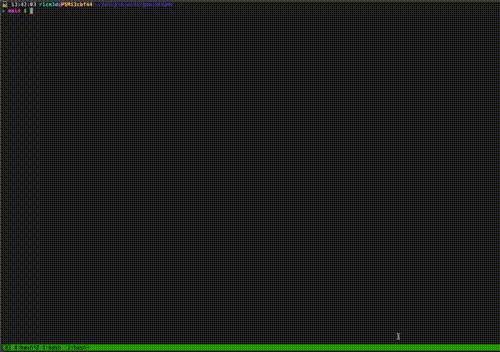

# gk-yaml 
[](https://github.com/r1cm3d/gk-yaml/blob/master/LICENSE)

**TL;DR:**



## Prerequisites
[](https://github.com/rust-lang/rust)

## Table of Contents
* [TL;DR](#ppsch)
* [Prerequisites](#prerequisites)
* [About](#about-the-project)
* [Building](#building)
* [Installing](#installing)
* [Tips](#tips)
* [Testing](#testing)
* [Getting Help](#getting-help)

## About
A CLI application that helps to work with goalkeeper generating yaml files automatically.

## Building 
```
make build
```
It will call `cargo build` in order to download and build all dependencies.

## Installing
```
make install
```
It requires `GK_BIN` environment variable that must be on `PATH` environment variable. The user must have permissions to
write in this directory.

## Tips 
It is worth to keep most used commands in aliases as follows:
``` console
# Reprocess Clearing
alias repcleit='gk-yaml --envs itau --root-directory "$PROJECTS/goalkeeper" --squad "pci-authorizations" --channel C01QQ11RECT sqs reprocess  --src-queue "NetworkAuthorizationsClearing-dead-letter" --dst-queue NetworkAuthorizationsClearing'
alias repclemt='gk-yaml --envs multitenant --root-directory "$PROJECTS/goalkeeper" --squad "pci-authorizations" --channel C01QQ11RECT sqs reprocess  --src-queue "NetworkAuthorizationsClearing-dead-letter" --dst-queue NetworkAuthorizationsClearing'
alias repcleboth='gk-yaml --envs multitenant itau --root-directory "$PROJECTS/goalkeeper" --squad "pci-authorizations" --channel C01QQ11RECT sqs reprocess  --src-queue "NetworkAuthorizationsClearing-dead-letter" --dst-queue NetworkAuthorizationsClearing'

# Download clearing
alias dowcleit='gk-yaml --envs itau --root-directory "$PROJECTS/goalkeeper" --squad "pci-authorizations" --channel C01QQ11RECT sqs download --queue "NetworkAuthorizationsClearing-dead-letter"'
alias dowclemt='gk-yaml --envs multitenant --root-directory "$PROJECTS/goalkeeper" --squad "pci-authorizations" --channel C01QQ11RECT sqs download --queue "NetworkAuthorizationsClearing-dead-letter"'
alias dowcleboth='gk-yaml --envs multitenant itau --root-directory "$PROJECTS/goalkeeper" --squad "pci-authorizations" --channel C01QQ11RECT sqs download --queue "NetworkAuthorizationsClearing-dead-letter"'

# Reprocess Ledger
alias repledt='gk-yaml --envs itau --root-directory "$PROJECTS/goalkeeper" --squad "pci-authorizations" --channel C01QQ11RECT sqs reprocess  --src-queue "NetworkAuthorizationsLedgerIntegrity-dead-letter" --dst-queue NetworkAuthorizationsLedgerIntegrity'
alias repledmt='gk-yaml --envs multitenant --root-directory "$PROJECTS/goalkeeper" --squad "pci-authorizations" --channel C01QQ11RECT sqs reprocess  --src-queue "NetworkAuthorizationsLedgerIntegrity-dead-letter" --dst-queue NetworkAuthorizationsLedgerIntegrity'
alias repledboth='gk-yaml --envs multitenant itau --root-directory "$PROJECTS/goalkeeper" --squad "pci-authorizations" --channel C01QQ11RECT sqs reprocess  --src-queue "NetworkAuthorizationsLedgerIntegrity-dead-letter" --dst-queue NetworkAuthorizationsLedgerIntegrity'

# Download Ledger
alias dowledit='gk-yaml --envs itau --root-directory "$PROJECTS/goalkeeper" --squad "pci-authorizations" --channel C01QQ11RECT sqs download --queue "NetworkAuthorizationsLedgerIntegrity-dead-letter"'
alias dowledmt='gk-yaml --envs multitenant --root-directory "$PROJECTS/goalkeeper" --squad "pci-authorizations" --channel C01QQ11RECT sqs download --queue "NetworkAuthorizationsLedgerIntegrity-dead-letter"'
alias dowledboth='gk-yaml --envs multitenant itau --root-directory "$PROJECTS/goalkeeper" --squad "pci-authorizations" --channel C01QQ11RECT sqs download --queue "NetworkAuthorizationsLedgerIntegrity-dead-letter"'
```

If one want to reprocess Clearing DLQ for both environments I only have to type:
```
repcleboth
```
and open the PR with [gh cli](https://github.com/cli/cli).

## Testing 
```
make test 
```
It will call `cargo test` aiming to run the basic unit tests.

## Getting Help

```console
./gk-yaml --help
```

Help information will be displayed:

```console
gk-yaml - goalkeeper yaml generator 0.1.0
A CLI application that helps to work with goalkeeper generating yaml files automatically.

USAGE:
    gk-yaml --channel <CHANNEL> --squad <SQUAD> --root-directory <ROOT_DIRECTORY> --envs <ENVS>... <SUBCOMMAND>

OPTIONS:
    -c, --channel <CHANNEL>
            The slack channel to send tasks notifications

    -e, --envs <ENVS>...
            Environment related to the task. It accepts a list: ext,itau,multitenant [possible
            values: itau, multitenant, india, ext]

    -h, --help
            Print help information

    -r, --root-directory <ROOT_DIRECTORY>
            Directory that [goalkeeper](https://github.com/pismo/goalkeeper) is located

    -s, --squad <SQUAD>
            Squad related to the task. It is used to create file path

    -V, --version
            Print version information

SUBCOMMANDS:
    help    Print this message or the help of the given subcommand(s)
    sqs   
```
